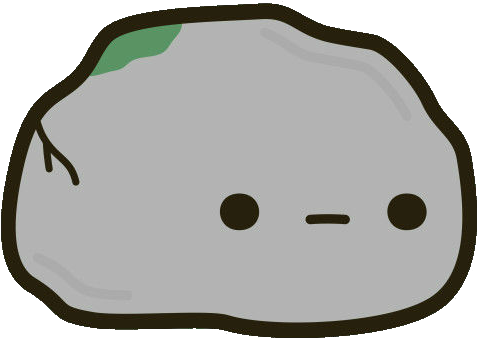

# __
Игра "камень, ножницы, бумага"
__

Вэб-версия игры, в которой предстоит сразиться против генератора случайных чисел.

- С помощью тоггла "extend" можно разнообразить процесс игры, добавив ***ящерицу*** и ***спока***.

- Если забыли что делают ящерица и спок, то есть ***попап с правилами игры***.
___

Игра сделана в качестве практики. 

- В проекте реализованы: ***адаптивная верстка***; всплывающие ***попапы*** результата матча и правил игры (при нажатии на копку); **тоггл**, меняющий интерфейс и правила игры; ***валидация*** кнопки start; подсчет раундов и счета игроков.

- Технологии: JavaScript(ES6); CSS; HTML;

___
**
Ссылка на игру под камнем
**

  

___

Требования для запуска:
- Браузеры, поддерживающие ES6: Chrome(версия 61 и новее, мобильная версия - 104 и новее); Edge(версия 79 и новее); Safari(версия 11 и новее); Firefox(версия 60 и новее, Firefox Mobile - версия 101 и новее); Opera(версия 48 и новее, Opera Mobile - версия 64 и новее)
